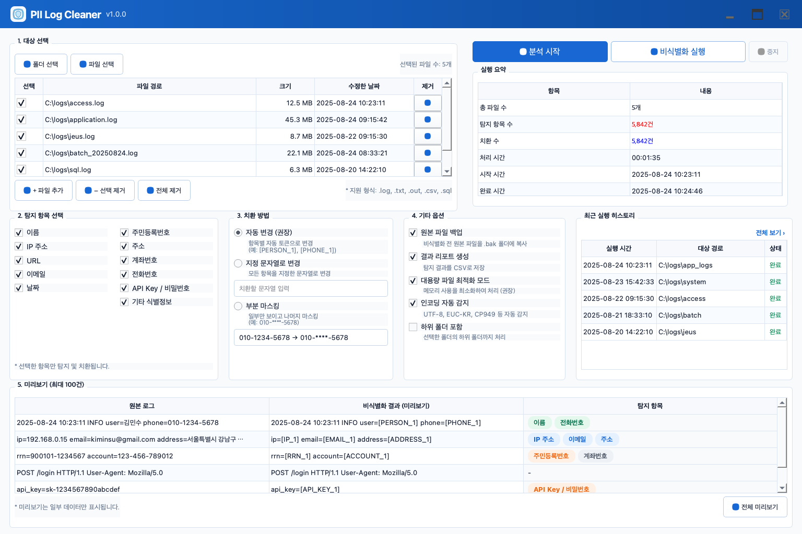

# PII Log Cleaner

로그·텍스트 파일을 분석한 뒤 원본과 분리된 비식별화 결과를 만드는 오프라인 Windows 데스크톱 프로그램입니다.

## 라이선스

PII Log Cleaner의 자체 작성 소스 코드와 문서는 [Apache License 2.0](LICENSE) (`Apache-2.0`)으로 배포합니다. 다만 `resources/icons/flaticon/`, Python 의존성, 번들 모델은 각각 별도 라이선스가 적용되며 [THIRD_PARTY_NOTICES.md](THIRD_PARTY_NOTICES.md)를 함께 확인해야 합니다.

## 화면 예시



파일 선택, 탐지 항목, 실행 요약, 비식별화 미리보기를 포함한 데모 화면입니다.

## 주요 기능

- 제공된 화면 구성을 반영한 PySide6 단일 화면 UI: 파일/폴더 선택·드래그앤드롭 추가, 11개 탐지 항목, 치환 방식, 실행 요약, 이력, 3열 미리보기
- 주민등록번호 형식, 국내 전화번호, 이메일, IPv4, URL, 날짜, 계좌번호 문맥값, API 키/비밀번호 문맥값의 정규식 탐지
- 위치 기반 중첩 해결과 치환으로 원문 일부가 잘못 바뀌지 않도록 처리
- 로컬 `schift-ko-pii-v6` 모델 어댑터: 실행 전에 `HF_HUB_OFFLINE=1`, `TRANSFORMERS_OFFLINE=1`을 설정하며 실행 중 모델을 내려받지 않음
- 한 번의 스트리밍 처리로 분석·미리보기·별도 `_deid` 출력, 선택적 원본 백업, CSV 집계 보고서, PII를 저장하지 않는 로컬 SQLite 실행 이력

## 모델도 설치파일에 포함되나요?

네. **저장소에 포함된 로컬 모델 스냅샷은 최종 `PII-Log-Cleaner-Setup.exe` 안에 포함됩니다.**

모델 원본 파일은 Git 호스팅의 파일당 크기 제한을 넘지 않도록 저장소 안에서 50MB 조각으로 관리합니다. 빌드 스크립트가 SHA-256을 확인해 원본 `model.safetensors`를 자동 복원한 후, PyInstaller의 `--add-data`로 `models\schift-ko-pii-v6` 경로에 복사합니다. 이후 Inno Setup이 PyInstaller 결과 폴더 전체를 하나의 설치파일로 묶습니다. 설치된 프로그램은 번들 모델만 읽으며 인터넷에서 모델을 받지 않습니다.

모델 가중치와 원본 `LICENSE` 파일도 저장소에 포함합니다. 모델과 런타임이 함께 들어가므로 설치파일 크기는 커집니다.

## 모델 라이선스와 배포 조건

`schift-io/schift-ko-pii-v6` 모델은 **Apache-2.0이 아닌 [Schift License v2.0](https://huggingface.co/schift-io/schift-ko-pii-v6/blob/main/LICENSE)**으로 배포됩니다. 이 라이선스는 Apache License 2.0을 기반으로 하지만, 최근 완료 회계연도 기준 연 매출이 미화 1,000만 달러를 초과하는 법인의 상업적 사용에는 별도 상용 라이선스를 요구하는 추가 조건이 있습니다. 연구·교육·평가·개인 프로젝트·비영리 단체 사용은 매출과 무관하게 허용된다고 모델 라이선스에 명시되어 있습니다.

따라서 이 저장소의 `Apache-2.0` 표기는 PII Log Cleaner의 자체 작성 코드·문서에만 적용되며, 모델 가중치·모델 코드에는 적용되지 않습니다. Windows 설치파일을 배포할 때는 모델 스냅샷에 포함된 원본 `LICENSE*` 파일을 변경하지 않고 함께 포함해야 합니다. 빌드 스크립트가 이를 확인하며, 상세 고지는 [THIRD_PARTY_NOTICES.md](THIRD_PARTY_NOTICES.md)에 제공합니다. 모델 라이선스는 배포 전 해당 스냅샷의 원문으로 다시 확인하세요.

## Windows에서 단일 설치파일 만들기

빌드 머신 준비물:

1. 64비트 Python 3.11 권장(3.10 이상 지원)과 Inno Setup 6

PowerShell에서 실행합니다.

```powershell
.\build-windows.ps1
```

완료되면 `dist\PII-Log-Cleaner-Setup.exe` 한 개가 만들어집니다. 내부적으로는 PyInstaller `onedir` 구조를 사용해 모델을 설치 폴더에 정상 배치한 뒤, Inno Setup이 이를 단일 설치파일로 만듭니다.

빌드 스크립트는 `py -3`이 실패해도 PATH의 `python`, `python.exe`, `python3`을 차례로 확인해 현재 설치된 64비트 Python 3.10 이상을 선택합니다. 여러 런타임이 있거나 자동 탐지가 실패하면 다음처럼 현재 `python -V`에서 보이는 실행 파일만 직접 지정할 수 있습니다.

```powershell
$pythonExe = (Get-Command python -CommandType Application).Path
.\build-windows.ps1 -PythonExe $pythonExe
```

`python -V`가 정상 출력되는데도 빌드가 실패했다면 위의 `-PythonExe` 방식으로 실행합니다. 모델 경로는 묻지 않으며, 누락되거나 변조된 모델 조각은 SHA-256 검증 단계에서 중단됩니다.

## 브랜딩 자산

사용자가 제공한 방패·문서·빗자루 이미지를 앱 창 아이콘, Windows 실행 파일·설치 마법사 아이콘으로 사용합니다. 워드마크 이미지는 제목 표시줄에 사용하며, 기능 버튼의 보조 아이콘은 기존 Flaticon 자산을 유지합니다.

## 로컬 검사

```bash
python3 -m unittest discover -s tests -v
```

`--demo`, `--allow-regex-only`는 번들 모델 없이 UI를 확인하기 위한 개발 전용 옵션이며 Windows 설치 경로에서는 사용하지 않습니다.
